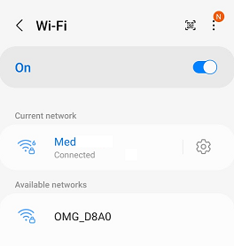
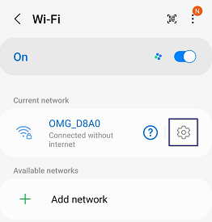
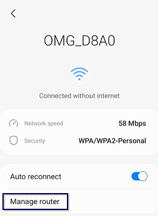
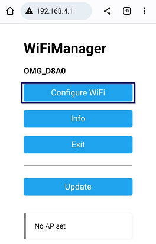
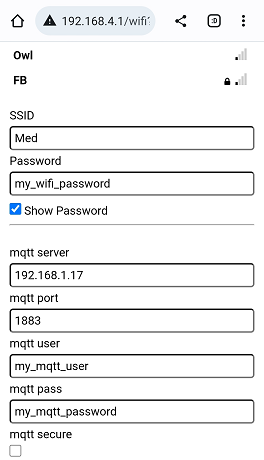

## Theengs Bridge, Easy Setup Guide

Discover the **Theengs Bridge**, a smart Bridge and BLE gateway in one device. This guide will help you quickly connect your Bridge to an MQTT broker.

1. **Plug it in**: Connect the device to a 5V USB-C power supply. An orange LED will turn on steadily.

2. **Connect to WiFi**: On your smartphone, search for a WiFi network starting with `OMG_`.
Alternatively, you can connect an ethernet cable to the bridge and access the configuration by typing the bridge IP into a browser (the bridge IP can be found on your router or by a serial connection)

  

3. **Access the setup page**: A webpage may pop up automatically. If not, click on the gear icon next to the WiFi network.

  

1. Then click on "Manage router".

  

::: tip
If your smartphone disconnects from the Bridge's WiFi network and reconnects to your main WiFi, "forget" your main WiFi to maintain a stable connection with the Bridge. After configuration, reconnect to your main WiFi. If the configuration portal doesn't appear, access it at `192.168.4.1` in your web browser.
:::

4. **Configure WiFi**: Click on "Configure WiFi".

  

5. **Enter your settings**: Fill in the following required details:
* Your WiFi Access Point (SSID - optional if ethernet connected)
* Your WiFi password (Password - optional if ethernet connected)
* Your MQTT server
* Your MQTT port

Optionally, adjust the following settings if needed:
* MQTT user
* MQTT password
* Secure connection and certificates (if required)
* Gateway name
* Base topic
* Password (this password will be used for configuration portal and Over The Air updates)

  

::: tip
When using the bridge with ethernet, entering WiFi Access Point and Password will enable to have a fallback connection network if ethernet is disconnect.
:::

6. **Save**: Click on Save.

When connected, the bridge first LED should turn green and second LED will blink blue during scanning.

For further integration with a Home Automation Controller, refer to the [OpenMQTTGateway documentation](https://docs.openmqttgateway.com/use/ble.html).

For assistance or support, email: [florian@theengs.io](mailto:florian@theengs.io).

## Safety Instructions
When using the Theengs Bridge, please follow these safety guidelines to ensure proper operation and to prevent potential hazards:

a. Read and follow all instructions provided in this manual before using the Theengs Bridge.

b. The Theengs Bridge is designed for indoor use only. Do not use it outdoors or expose it to moisture, excessive heat, or direct sunlight.

c. Ensure that the power supply used is in good working condition and complies with local electrical codes.

e. Keep the Theengs Bridge away from water, flammable materials, and sources of ignition.

f. Disconnect the Theengs Bridge from its power supply before cleaning or performing any maintenance. Use a dry cloth to clean the Theengs Bridge, and avoid using harsh chemicals or abrasive materials.

g. Do not attempt to disassemble, repair, or modify the Theengs Bridge. Doing so may cause damage, void the warranty, and potentially create safety hazards.

h. In the event of a malfunction or suspected problem with the Theengs Bridge, disconnect it immediately and contact customer support for assistance.

i. Keep the Theengs Bridge and its packaging materials out of reach of children and pets to avoid the risk of choking or injury.

## Specifications
| Feature         | Specification                                |
|-----------------|----------------------------------------------|
| Power Supply    | USB-C 5.0V                                   |
| Microcontroller | ESP32                                        |
| Memory          | 8MB                                          |
| WiFi Band       | 2.4 GHz                                      |
| Protocol        | MQTT                                         |
| Ethernet        | RJ45                                         |
| Antenna         | 2.4GHz 6dBi 50ohm Wireless Antenna           |
| LED             | 4 RGBs                                       |
| Board type      | Development board with Grove connector       |
| Dimensions      | 4.05in * 1.37in * 2.4in (160 × 120 × 30 mm without antenna) |
|Usage| Indoor use only|

## Warranty
The Theengs Bridge hardware warranty is one year from the date of purchase. See details [here](https://shop.theengs.io/pages/limited-product-warranty)

The Bridge is delivered with firmware developed under [GPLv3 license](https://github.com/1technophile/OpenMQTTGateway/blob/development/LICENSE.txt), by using it, you accept the terms and conditions of this license.
