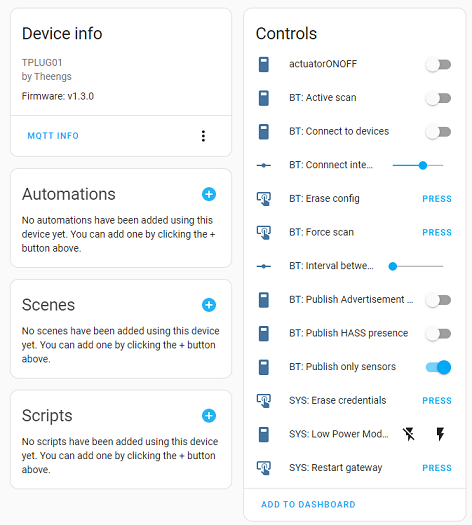
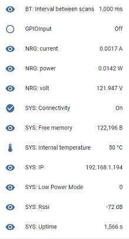
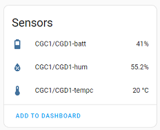

# User Guide

## LED Indicator Guide

### Steady Orange
The bridge is generating an Access Point for network onboarding.

### Orange (5 seconds on, 5 seconds off)
The bridge is disconnected from the MQTT broker.

### Orange (2 seconds on, 2 seconds off)
The bridge is disconnected from the WiFi network.

### Steady Green
The bridge is connected to both the network and the MQTT broker.

### Steady Blue
An update or operation is currently in progress.

### Flashing Blue
Scanning or communication is in progress.

## Modules and Parameters

### Home Assistant Discovery Convention
The bridge publishes its configuration and detected BLE sensors to the broker following the [Home Assistant discovery convention](https://www.home-assistant.io/integrations/mqtt/#mqtt-discovery). You can find the devices in the Configuration->Devices menu with [Home Assistant](https://docs.openmqttgateway.com/integrate/home_assistant.html).

<p align="left">
  
</p>

<p align="left">
  
</p>

::: tip
Other controllers can also use the Home Assistant convention for automatic discovery.
:::

### Bluetooth Gateway
The bridge detects [Bluetooth devices](https://docs.openmqttgateway.com/prerequisites/devices.html#for-ble-devices) and publishes their data to the MQTT broker.
```
home/112233445566/BTtoMQTT/AABBCCDDEEFF
{"id":"AA:BB:CC:DD:EE:FF","rssi":-88,"brand":"ClearGrass/Qingping","model":"Alarm Clock","model_id":"CGC1/CGD1","tempc":20.3,"tempf":68.54,"hum":55.3,"batt":41}
```
For example with auto-discovery
<p align="left">
  
</p>

### Default parameters
* Adaptive scanning activated (from v1.5.0)
* Connect to BLE devices deactivated
* BLE adaptive scan activated

The BLE parameters can be changed with the commands detailed into [BLE gateway usage](https://docs.openmqttgateway.com/use/ble.html).

## Erasing Theengs Bridge configuration
If connected to an MQTT broker, the bridge configuration can be erased with an [MQTT command](https://docs.openmqttgateway.com/use/gateway.html#erase-the-esp-settings) or the button available in HA "SYS: Erase credentials".
If not connected to an MQTT broker you can reset the board by following the procedure below:
* Connect the bridge to your computer with a USB cable
* Go to the upload portal https://docs.openmqttgateway.com/upload/web-install.html
* Select "theengs-bridge", and keep "Erase Flash" selected
* Click on INSTALL, and wait a few minutes
* The bridge will have now the latest version and the settings erased

## Updating Theengs Bridge
Theengs bridge can benefit from updates following these different methods:
* From Home Assistant directly, Settings->Devices & Services->Devices, click on the bridge, click on the firmware version, click Update
* By connecting to your computer with a USB cable
  * Go to the upload portal https://docs.openmqttgateway.com/dev/upload/web-install.html
  * Select "theengs-bridge", and unselect "Erase Flash" to keep your parameters
  * Click on INSTALL, and wait a few minutes
  * The bridge will have now the latest version
* From the WifiManager portal, by uploading a binary directly to the bridge
  * Download the last version binary named "Theengs-Bridge-firmware" from the Github [release page of OpenMQTTGateway](https://github.com/1technophile/OpenMQTTGateway/releases)
  * Connect to the Wifi access point with your smartphone
  * Click Update
  * Add the binary downloaded previously
  * Click Update and wait a few minutes until you get "Update successfull"
  * Reconfigure the bridge into the Wifi portal
* From an MQTT command to trigger the download of the firmware from a webserver
  * Connect to your MQTT broker with a client like MQTT Explorer
  * Publish the update command like below (OTAPASSWORD being your Over The Air password if you changed it during the configuration):

```
{
  "version": "latest"
}
```
To this topic (112233445566 being your gateway_name):
```
home/112233445566/commands/MQTTtoSYS/firmware_update
```
  * The bridge will restart with the new version
